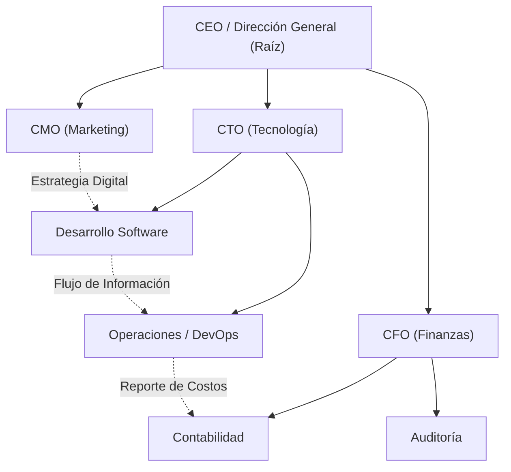

# 🌳 UAO - Modelado y Simulación de Árboles y Grafos Organizacionales

[](https://www.uao.edu.co/)
[](https://github.com/EduardCY/UAO-EDA2-Arboles-Grafos-Organizacionales)
[](https://react.dev/)
[](LICENSE)
[](.github/workflows/ci.yml)
[](https://github.com/EduardCY)

> **Simulador interactivo** para el diseño, balanceo y visualización de **Árboles Binarios de Búsqueda (BST)**, jerarquías corporativas y **Grafos de dependencias interdepartamentales** con algoritmos de recorrido en profundidad (DFS) y amplitud (BFS).

---

## 🎯 Capacidades Técnicas del Simulador

1. **Estructuras Jerárquicas (Árboles):**
   * Construcción interactiva de jerarquías organizacionales y organigramas.
   * Cálculo de altura, nivel, profundidad, factor de balanceo y grado de nodos.
   * Recorridos canónicos: **In-Orden**, **Pre-Orden** y **Post-Orden**.
2. **Estructuras Relacionales (Grafos):**
   * Modelado de relaciones matriciales y flujo de comunicación departamental.
   * Búsqueda de caminos mínimos y análisis de conectividad.

---

## 🏛️ Topología de Datos Jerárquica y Relacional



---

## ⚡ Métricas de Rendimiento Algorítmico

| Algoritmo / Operación | Mejor Caso | Peor Caso | Memoria Auxiliar | Descripción |
|---|---|---|---|---|
| **Búsqueda en Árbol (BST)** | $O(1)$ | $O(h)$ donde $h \le n$ | $O(1)$ | Búsqueda por clave comparativa. |
| **Recorrido In-Orden** | $O(n)$ | $O(n)$ | $O(h)$ (Pila llamada) | Genera listado ordenado ascendente. |
| **Recorrido Pre-Orden** | $O(n)$ | $O(n)$ | $O(h)$ (Pila llamada) | Útil para clonación y serialización de árbol. |
| **Recorrido BFS (Amplitud)** | $O(V + E)$ | $O(V + E)$ | $O(V)$ (Cola) | Exploración nivel por nivel en grafos. |
| **Recorrido DFS (Profundidad)**| $O(V + E)$ | $O(V + E)$ | $O(V)$ (Pila) | Detección de ciclos y conectividad. |

---

## 🚀 Instalación y Uso

```bash
git clone https://github.com/EduardCY/UAO-EDA2-Arboles-Grafos-Organizacionales.git
cd UAO-EDA2-Arboles-Grafos-Organizacionales

npm install
npm run dev
```

---

## 👨‍💻 Autor

* **Autor:** Eduard Criollo Yule ([@EduardCY](https://github.com/EduardCY))
* **Licencia:** [MIT](LICENSE).
